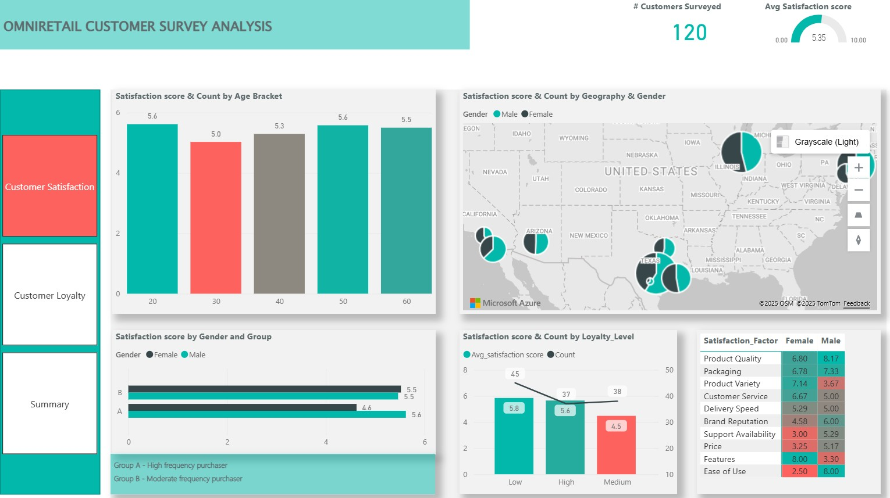
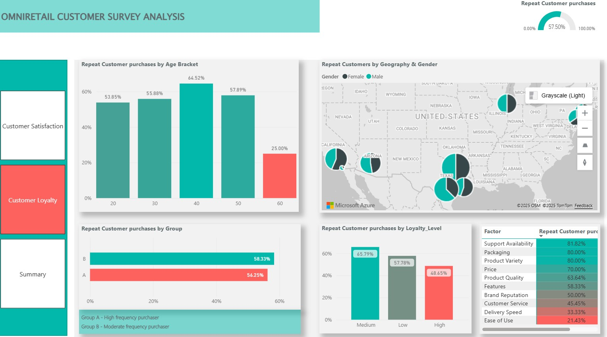
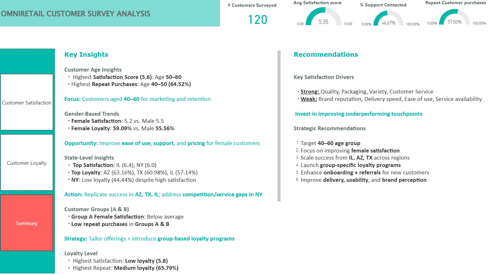

# OMNIRETAIL Customer Satisfaction & Loyalty Analytics  
**DataDNA July 2025 Challenge | Power BI Project**

## About the Project

This project was completed as part of the **#DataDNA July Challenge** hosted by [Onyx Data](https://www.onyxdata.co.uk/datadna/). This project explores **customer satisfaction and loyalty** using survey data from a retailer – **OMNIRETAIL**.

---

## Objective

A customer satisfaction dataset has been provided, containing satisfaction scores, purchasing behaviour, demographics, support history, and location data. The objective is to create an analytical report that identifies the key factors influencing customer satisfaction and loyalty across different regions, customer demographics, and support experiences. 

---

## Dataset

The dataset provided customer-level survey responses covering:

| **Column Name**        | **Description**                                                                                 |
|:-----------------------|:------------------------------------------------------------------------------------------------|
| `Customer_ID`          | Unique customer identifier (for internal use only)                                              |
| `Group`                | Customer classification: A, B, or C    • Group A: High-frequency shoppers    • Group B: Moderate-frequency    • Group C: New or low-frequency |
| `Satisfaction_Score`   | Customer’s rating of their experience (1 = very poor, 10 = excellent)                           |
| `Age and Gender`       | Demographic attributes                                                                           |
| `Location`             | City and State (e.g., Austin, TX), with Latitude and Longitude for geographic mapping            |
| `Purchase_History`     | Indicates if the customer has made purchases (`Yes` / `No`)                                     |
| `Support_Contacted`    | Whether the customer interacted with support (`Yes` / `No`)                                      |
| `Loyalty_Level`        | OmniRetail’s internal rating: `Low`, `Medium`, or `High` loyalty                                |
| `Satisfaction_Factor`  | The main reason influencing the satisfaction score (e.g., `Price`, `Product Variety`, `Packaging`) |

---

## Tools used

- **Power BI**

---

## Data preparation
Data was imported into Power BI and the following actions were performed:
1. Split the column Location into City and State
2. Categorise the City, State, Longitude, and Latitude fields under the 'Geography' data category for accurate geo-mapping in Power BI
3. Transform the 'Age' column into categorical age brackets (20–30, 30–40, 40–50, 50–60, 60–70) to support demographic segmentation and analysis

---

## Measures (KPIs)

Developed DAX measures to calculate:
1. Average Satisfaction score
2. Customers surveyed count
3. Repeat purchase Rate (%)
4. Support Contact Rate (%)

---

## Visualizations

1. **Clustered Column Chart** satisfaction score and count by Age bracket
2. **Azure Map** satisfaction score and count by Geography & Gender
3. *Clustered Bar Chart** satisfaction score by Gender & Group
4. **Combo Chart** satisfaction score and count by loyalty_level
5. **Matrix** satisfaction factor, satisfaction score by Gender
6. **card** Customers surveyed count
7. **Gauge** Average Satisfaction score
8. **Gauge** Repeat purchase Rate (%)
9. **Gauge** Support Contact Rate (%)
10. Same charts from 1-5 for customer loyalty
11. **Page navigation and back button**

---
## Summary

- Created a summary with key insights
- Offered strategic recommendations for improving the Omniretail business, customer satisfaction, and retention
 
---

## Power BI report

[Access the Power BI report](https://github.com/vibvinit/dataDNA_July2025_Challenge/blob/main/DataDNY_July_Challenge_OmniRetail_Customer_Survey_Analysis.pbix)

---

## Report Screenshots

----

----

----
